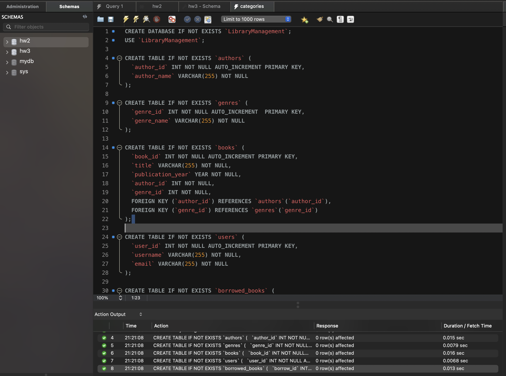
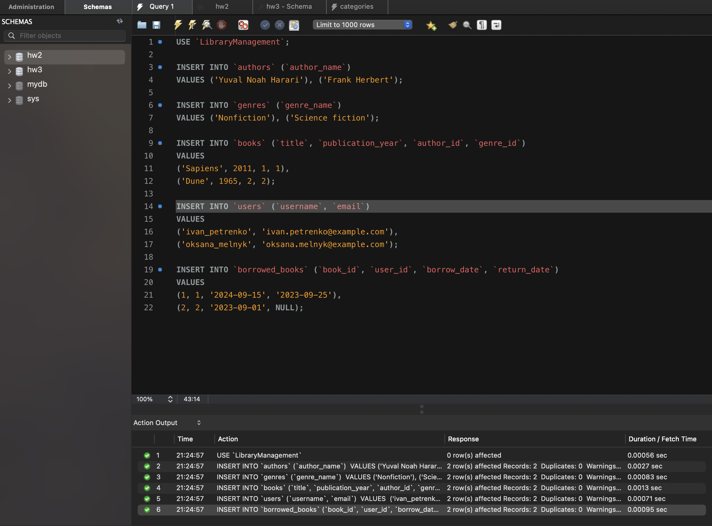
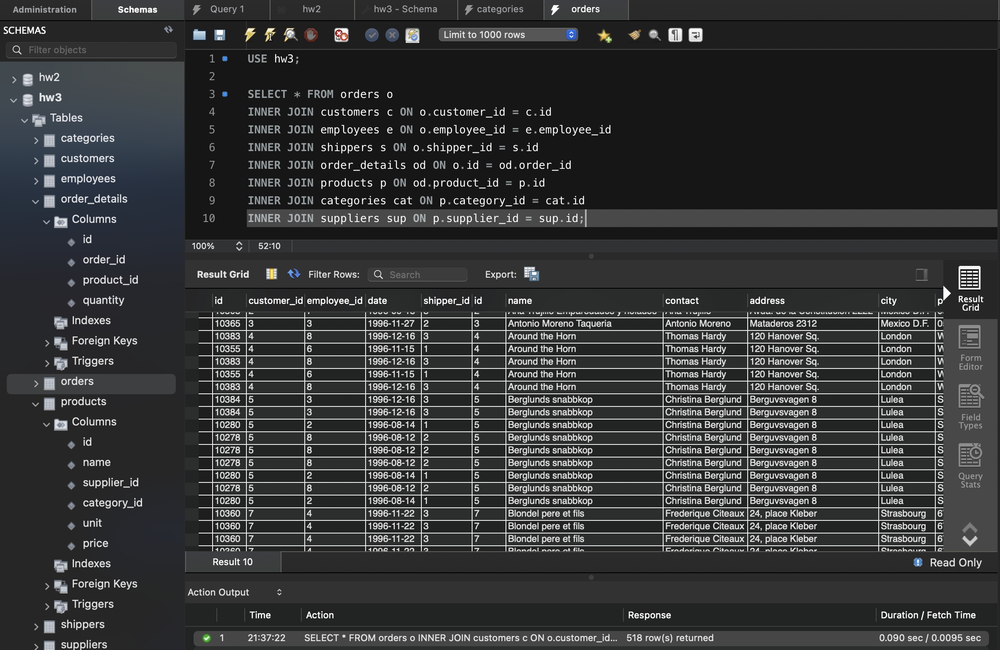
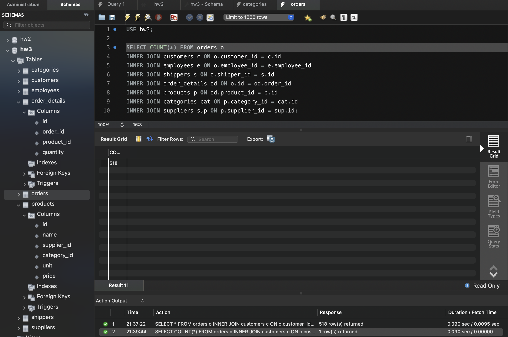
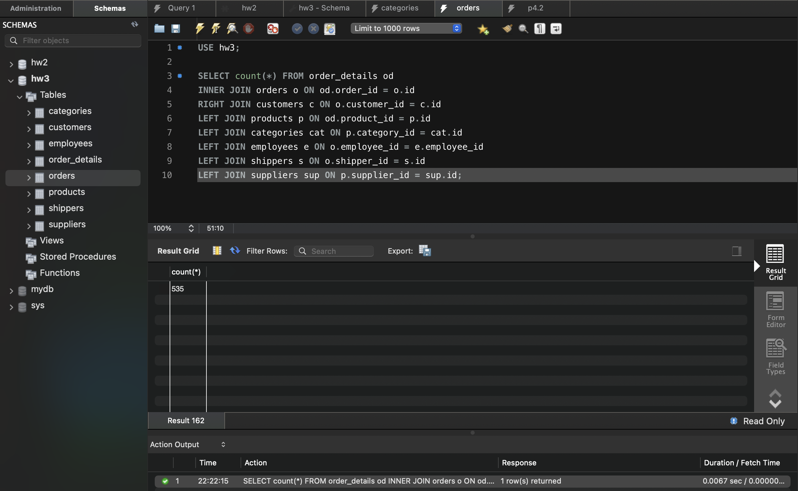
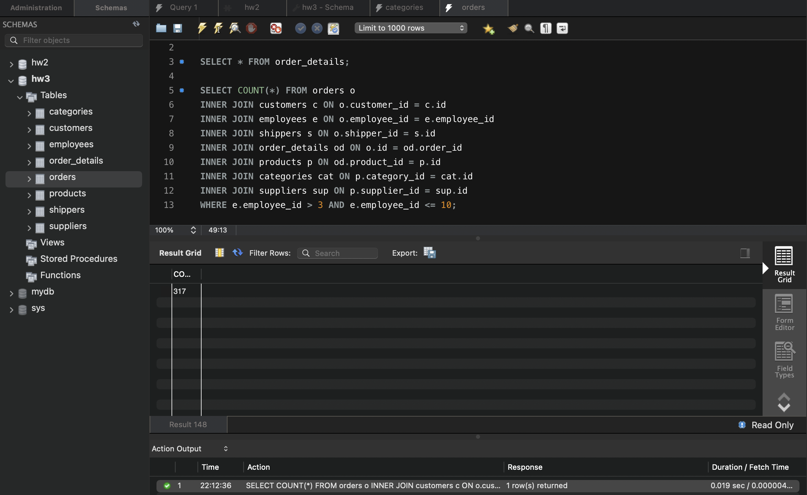
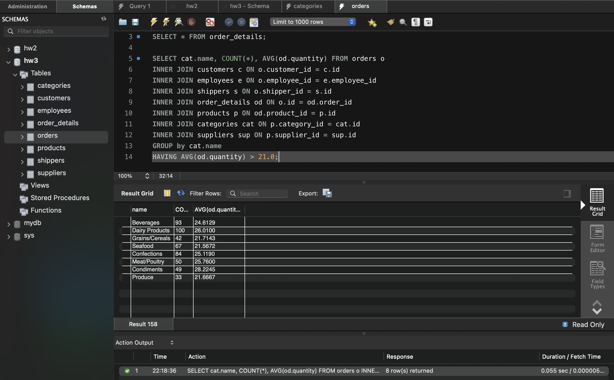
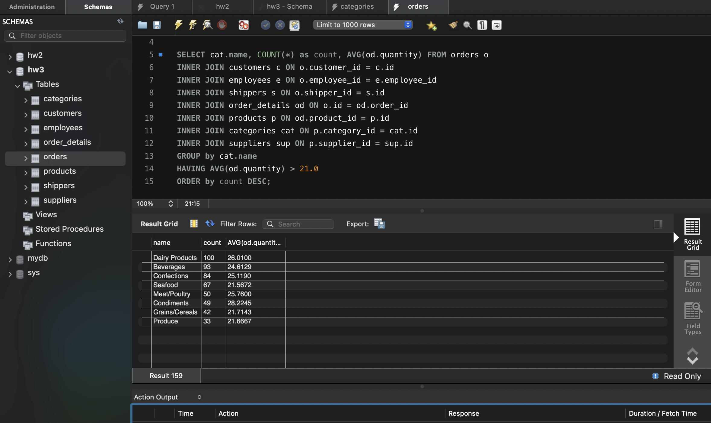
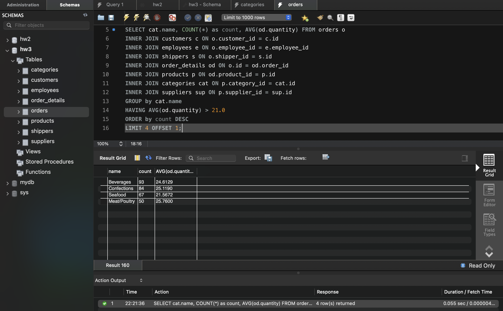

# goit-rdb-hw-04

Author: M.Podopryhora

## Task 1

Створіть базу даних для керування бібліотекою книг згідно зі структурою,
наведеною нижче. Використовуйте DDL-команди для створення необхідних таблиць та
їх зв'язків.

Структура БД

- Назва схеми — “LibraryManagement”

- Таблиця "authors":
  - author_id (INT, автоматично зростаючий PRIMARY KEY)
  - author_name (VARCHAR) c)
- Таблиця "genres":
  - genre_id (INT, автоматично зростаючий PRIMARY KEY) genre_name (VARCHAR) d)
- Таблиця "books":
  - book_id (INT, автоматично зростаючий PRIMARY KEY)
  - title (VARCHAR)
  - publication_year (YEAR)
  - author_id (INT, FOREIGN KEY зв'язок з "Authors")
  - genre_id (INT, FOREIGN KEY зв'язок з "Genres")
- Таблиця "users":
  - user_id (INT, автоматично зростаючий PRIMARY KEY)
  - username (VARCHAR)
  - email (VARCHAR)
- Таблиця "borrowed_books":
  - borrow_id (INT, автоматично зростаючий PRIMARY KEY)
  - book_id (INT, FOREIGN KEY зв'язок з "Books")
  - user_id (INT, FOREIGN KEY зв'язок з "Users")
  - borrow_date (DATE)
  - return_date (DATE)

## Task 2

Заповніть таблиці простими видуманими тестовими даними. Достатньо одного-двох
рядків у кожну таблицю.

## Task 3

Перейдіть до бази даних, з якою працювали у темі 3. Напишіть запит за допомогою
операторів FROM та INNER JOIN, що об'єднує всі таблиці даних, які ми завантажили
з файлів: order_details, orders, customers, products, categories, employees,
shippers, suppliers. Для цього ви маєте знайти спільні ключі.

## Task 4.1

Визначте, скільки рядків ви отримали (за допомогою оператора COUNT).

## Task 4.2

Змініть декілька операторів INNER на LEFT чи RIGHT. Визначте, що відбувається з
кількістю рядків. Чому? Напишіть відповідь у текстовому файлі.

## Task 4.3

Оберіть тільки ті рядки, де employee_id > 3 та ≤ 10.

## Task 4.4

Згрупуйте за іменем категорії, порахуйте кількість рядків у групі, середню
кількість товару (кількість товару знаходиться в order_details.quantity)

## Task 4.5

Відфільтруйте рядки, де середня кількість товару більша за 21.

## Task 4.6

Відсортуйте рядки за спаданням кількості рядків.

## Task 4.7

Виведіть на екран (оберіть) чотири рядки з пропущеним першим рядком.

